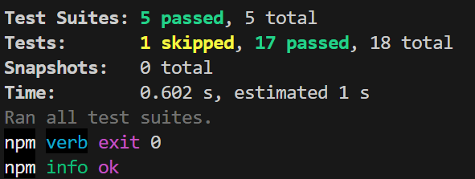

## Aufgabe 1:
Ergänze die calculator.js aus dem Vormittag um passende "subtract(a,b)" und "multiply(a,b)" Funktionen. Schreibe für beide jeweils 3 Tests und setze a und b dabei wie folgt:
- a und b positiv ✅
- a oder b negativ ✅
- a oder b ist 0 ✅

Achte auf sinnvolle und aussagekräftige Testnahmen! Es darf bei Abgabe kein Test fehlschlagen. ✅

## Aufgabe 2.1:
Erstelle eine neue Datei "minMax.js".
Schreibe in minMax.js folgende Funktionen:
- min(a, b) : gibt den kleineren Wert (also a oder b) zurück ✅
- max(a,b) : gibt den größeren Wert (also a oder b) zurück. ✅
Überlege dir hierfür selbst eine kleine Logik. Du darfst keine fremden Methoden wie Math.min() oder Math.max() nutzen. ✅

## Aufgabe 2.2:
Erstelle eine passende Test-Datei für "minMax.js". ✅
Überlege selbst jeweils 3 sinnvolle Testfälle. Implementiere diese. ✅

Es darf bei Abgabe kein Test fehlschlagen. ✅

## INFO
``npm test --verbose  ``

##### Das Flag --verbose wird verwendet, um den ausführlichen Modus für den Testlauf mit npm zu aktivieren. Wenn du npm test --verbose ausführst, werden zusätzliche Details während des Testlaufs angezeigt, einschließlich detaillierter Informationen über jeden Testfall, einschließlich Erfolgsmeldungen und Fehlermeldungen.

## Beispiel:

