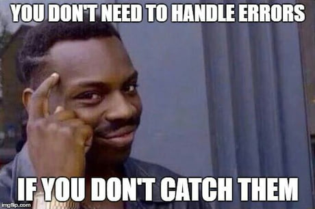

    

## Aufgabe 1:
Überarbeitet eure Testfiles von gestern. Ihr sollt mithilfe des heutigen Vormittags alle Testfiles sinnvoll mit describe Strukturieren und alle Tests sollten sinnvoll in Arrange, Act, Assert aufgeteilt sein (dabei darf Arrange leer sein).
Es müssen also in der Abgabe für diese Aufgabe also die gleichen Dateien wie gestern enthalten sein, nur "cleaner". ✅
Abgabe: Repo Link

## Aufgabe 2:
Probiert die Suffixes aus dem Unterricht aus. 
Angenommen wir haben eine Test-Datei mit 5 "Tests".
Ihr müsst für folgende Szenarien jeweils bestimmen, wie viele Tests überhaupt durchgeführt werden.
Wenn zwei Tests ".todo"-Suffix beinhalten
Wenn ein Test ".only"-Suffix beinhaltet
Wenn drei Tests ".skip"-Suffix beinhalten
Wenn 2 Tests in einem Describe geschachtelt sind und dieses Describe den Suffix ".only" trägt.
Wenn 2 Tests den Suffix ".failing" beinhaltet.

Abgabe: Text
## Meine Antwort:

<u>Wenn zwei Tests das Suffix '.todo' haben:</u>

Da Tests mit dem Suffix ".todo" als zu erledigen markiert sind und nicht aktiv ausgeführt werden, werden in diesem Szenario insgesamt keine Tests durchgeführt.

<u>Wenn ein Test das Suffix ".only" hat:</u>

Wenn ein Test das Suffix ".only" hat, wird nur dieser spezifische Test ausgeführt. Daher wird in diesem Szenario nur ein Test durchgeführt.

<u>Wenn drei Tests das Suffix ".skip" haben:</u>

Tests mit dem Suffix ".skip" werden übersprungen und nicht ausgeführt. Daher werden in diesem Szenario zwei Tests (5 Tests insgesamt - 3 übersprungene Tests) durchgeführt.

<u>Wenn 2 Tests in einem Describe-Block verschachtelt sind und dieses Describe den Suffix ".only" trägt:</u>

Wenn das Describe-Block das Suffix ".only" hat, werden nur die Tests innerhalb dieses Blocks ausgeführt. Daher werden in diesem Szenario nur zwei Tests durchgeführt.

<u>Wenn 2 Tests das Suffix ".failing" haben:</u>

Tests mit dem Suffix ".failing" sollen fehlschlagen. Daher werden in diesem Szenario alle Tests durchgeführt, da die Tests trotz des Suffix ".failing" ausgeführt werden.

### Zusammenfassend werden in diesen Szenarien insgesamt folgende Tests durchgeführt:

- Wenn zwei Tests ".todo"-Suffix haben: 0 Tests
- Wenn ein Test ".only"-Suffix hat: 1 Test
- Wenn drei Tests ".skip"-Suffix haben: 2 Tests
- Wenn 2 Tests in einem Describe geschachtelt sind und dieses Describe den Suffix ".only" trägt: 2 Tests
- Wenn 2 Tests den Suffix ".failing" beinhalten: 5 Tests (alle Tests)
##

## Aufgabe 3:
Schaut in folgende Dateien: https://github.com/juliusstelldinger/testing/tree/main/unit-testing/tag-2/javascript-errors

Kopiert euch diese Dateien in euer Repo und sorgt dafür, dass diese Dateien beim ausführen mit dem "node"-Befehl keine Fehler mehr erzeugen. Nur mit Hilfe von try, catch, finally und console.log(). Ihr dürft den Code also nicht vom Fehler selbst bereinigen, sondern sollt diesen Behandeln.✅

    

